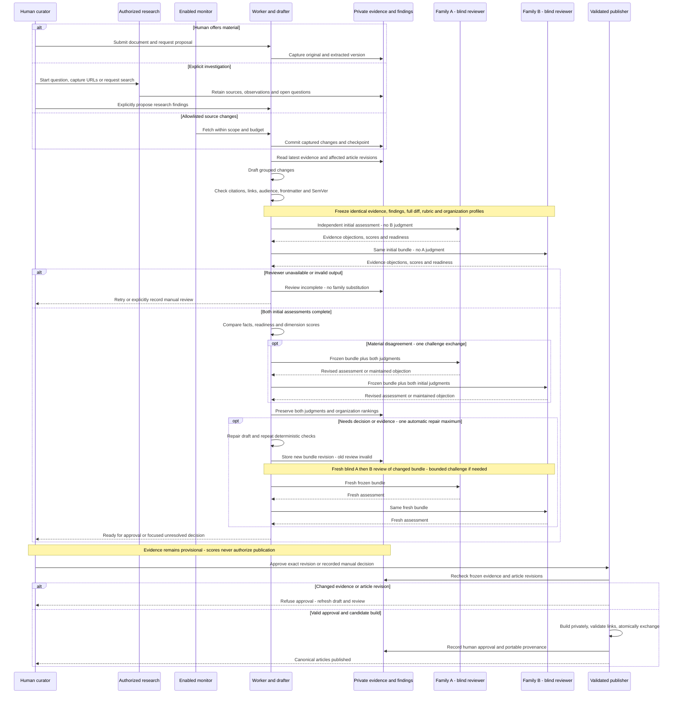

# Continuous discovery, research and reviewed publication

The Knowledge workspace connects human submissions, durable investigations and allowlisted source monitors to versioned evidence, grouped article proposals, independent model-family reviews and explicit human publication. Canonical articles remain Markdown. All source/workflow state is private and separate from static publication.

## Start and configure

The authoring server exposes `/knowledge.html` in the authoring-local publication profile. Existing authoring grants gate the private `/api/knowledge/` endpoints. Remote workflow actions require a signed-in principal so research ownership and publication decisions are attributable. The local loopback authoring flow remains available.

Run a separate worker **after deployment approval**:

```sh
python3 compile/knowledge_worker.py
```

Use `--once` for a single scheduler/job pass. No worker starts automatically with the web server, refresh timer or deployment poller. Stop the worker to stop new jobs; all persisted checkpoints, evidence, accepted articles and research remain recoverable. An already running operation finishes at its next boundary. Pausing a source is checked before each request and before committing captures.

Host configuration:

| Variable | Purpose |
| --- | --- |
| `KNOWLEDGE_HUB_STATE` | Private SQLite path; default `.private/knowledge.sqlite3`. An in-repository override must remain under `.private`. |
| `KNOWLEDGE_HUB_CREDENTIALS` | Path to a private host-owned JSON credential-reference registry, permissions `0600`. |
| `KNOWLEDGE_HUB_REVIEW_CONFIG` | Host-owned JSON file selecting one author and two reviewers. |
| `KNOWLEDGE_HUB_RESEARCH_SEARCH` | Optional host-owned search adapter configuration for explicitly requested web research. |
| `KNOWLEDGE_HUB_LLM_SSH_HOST` | Existing restricted shared-provider host from [ASK.md](ASK.md). |

A credential registry maps an operator-chosen reference to `type` (`github` or `bearer`), `origins` (exact HTTPS origins) and `environment` (the host environment variable containing the credential). Values never appear in monitor configuration, JSON exports, model contexts or error messages. Give GitHub credentials read-only access to just the selected repositories. The fetcher serializes requests sharing a reference, including anonymous requests. No source is enrolled merely because the credential can access it.

Review configuration shape:

```json
{
  "author": {"provider": "codex", "model": "gpt-5.6-sol", "effort": "medium"},
  "reviewers": [
    {"provider": "codex", "model": "gpt-5.6-sol", "effort": "high"},
    {"provider": "claude", "model": "claude-sonnet-5", "effort": "high"}
  ]
}
```

These examples must be qualified and enabled on the host. Configuration does not establish availability. Families are explicitly mapped to OpenAI and Anthropic; two aliases from one provider are refused. The dispatcher must be updated with the workflow schema modules listed in [ASK.md](ASK.md). Missing or invalid reviewers leave the bundle **Review incomplete**, never silently substitute.

New monitors are disabled. Add or import configuration, inspect the preview of the exact target and accessible scope, then explicitly enable. Preview expires after one hour or an edit. Edits disable collection and invalidate preview; evidence and revision history survive. Pause/retire never remove history. A rename uses the repository numeric identity to deduplicate; an ownership/visibility change or redirect pauses collection and blocks affected proposal publication for a fresh, explicitly acknowledged audience decision. Imports are bounded, validated and previewed; they exclude credential references and never enable sources. Assign a host credential reference through Edit before previewing authenticated imports.

Repository artifact defaults are issues, pulls, comments, reviews and diffs; releases and exact documentation/configuration path watches are opt-in. Filters use OR within labels/states/base branches and AND between filter categories; path exclusions win. No organization-wide discovery exists. An empty enabled artifact set collects only repository identity. Repository catalog entries are suggestions only.

## Collection contract and limits

GitHub collection starts with all open issues/PRs plus items updated in 30 days. Issue responses containing PRs are resolved through the PR endpoint and deduplicated. The collector independently revisits tracked parents and paginated comment/review/diff streams each cycle; this is more frequent than the required daily reconciliation when budgets permit. A large pending scan remains visibly incomplete until reconciliation finishes. Successful complete child listings retain absence events; an unsuccessful request, including a 404, never establishes deletion. Lifecycle snapshots distinguish proposals, repository merges and deployment evidence.

Requests use conditional headers, pagination, saved task continuations and a five-minute overlap. Captures and checkpoint progress share one SQLite transaction. Feed-followed links are limited to the feed origin plus explicitly allowed origins. Individual pages never crawl links. Redirects cannot carry credentials to another origin. Production connections pin a validated public DNS address and reject private/reserved destinations. Transport timeouts, server rate-limit instructions and per-source budgets produce deferred work.

Initial feed import requires a usable publication/update timestamp within 30 days. Undated initial entries are not assumed recent. Subsequent changed feed entries are inspected without rewriting old captured versions. Current connectors handle UTF-8 text, Markdown, HTML, JSON and XML. The existing fail-closed secret quarantine rejects binary or unscannable originals; PDF, office documents, OCR and transcription are not silently converted. Unsupported or refused capture is visible as incomplete work; it does not replace good evidence. Supply a UTF-8 export for these documents. Original retained bytes and normalized extracted text are separate. Cosmetic HTML changes may retain a new raw version without invoking synthesis.

Polling observes states rather than every intermediate edit. Webhook acceleration and workplace products remain optional future adapters. [GitHub polling guidance](https://docs.github.com/en/rest/using-the-rest-api/best-practices-for-using-the-rest-api) favors webhooks when available and conditional, serialized polling otherwise. The [issue API](https://docs.github.com/en/rest/issues/issues) can return PRs as well as issues.

## Research, review and publication

An investigation starts with an explicit question and space. URL captures and offered excerpts are durably retained immediately, before synthesis. Run investigation synthesis over the captured evidence, inspect separately typed findings and open questions, then explicitly propose article changes. Save creates a principal-owned research snapshot; closing an investigation preserves its evidence. Ordinary Ask does not retain conversations. Ask follow-up context lives only in browser memory and is bounded. Save and feedback are explicit signed-in actions. Retrieved published excerpts are labeled as source passages; they are not automatic proof that a generated claim is entailed.

Requested web search uses a host-approved HTTPS adapter returning `{"results":[{"url":"https://…","title":"…","snippet":"…"}]}`. The configuration supplies `endpoint`, optional `credential_ref` and optional `allowed_origins`. A query is sent as `q`. The original discovery response and up to five linked pages are captured; linked requests receive no search credentials. Results are discovery evidence, not primary proof. There is no autonomous unbounded crawl or implicit web search in published Ask. When no adapter is configured, the job remains incomplete and exact-URL capture remains usable.

Drafting combines latest source heads, full-text overlap, source dependencies and article links. It caps article candidates at twelve and explicitly reports coverage limits. Oversized contexts defer instead of silently discarding source material. One grouped proposal can edit multiple articles. An unchanged check creates no model call. A zero synthesis budget retains evidence without drafting.

Both reviewers receive identical frozen source versions, findings, existing article bytes, proposed diffs, versioned rubric and organizational profiles. Their initial responses are blind. Dimension scores are 0–4 with cited rationale or Unknown; unknowns retain their full possible weighted interval. The two reviewers are averaged per organization; combined queue priority uses the higher organization lower bound, with provisional intervals displayed. Philosophy relationship is separate from relevance. Material factual objections, readiness disagreement or a two-point dimension disagreement cause one challenge exchange. There is at most one automatic repair followed by a fresh pair of reviews. Earlier assessments remain in immutable history.

Deterministic checks enforce schema, known evidence IDs, exact source quotations in findings, article revision, evidence head, citation markers, link targets and audience. They do not prove semantic entailment; that remains a reviewer responsibility. An explicitly permitted evidence classification may support an article with the same or narrower audience. Internal evidence cannot support company-internal/public-candidate publication. New articles start internal. Existing article metadata, spaces and classifications are preserved.

Approving a bundle checks its revision and frozen hash again under the existing wiki write lock. A manual review is permitted only with a recorded substantive rationale; it does not bypass deterministic checks. The complete candidate static artifact is built privately; the previous served artifact remains available until successful atomic directory exchange. Article originals and approvals are journaled for crash recovery. Accepted captures reuse immutable manifest shards and the existing append-last ingestion ledger; replay completes these audit records idempotently. The accepted extracted evidence and provenance are copied to portable Markdown source files. Failed validation restores original files. Worker startup recovers interrupted publication before processing jobs. Publication never happens from a model, scheduler or MCP call.

### CFAR ingestion and research swim lanes

CFAR here is **Cross-Family Adversarial Review of the publication bundle**.
Reviewer A and Reviewer B are separately configured model-family roles. The
current implementation issues independent, initially blind **model assessments**;
it does not give either reviewer a tool-using investigation loop, browsing,
repository access, or authority to modify evidence. The worker calls A and then
B sequentially, without passing A's response to B. Separate families and blind
inputs are required; concurrency is not implemented. This is content review,
not a claim of independent agentic verification or software-review certification.

Evidence is retained before CFAR so rejected claims, contradictions and unresolved
questions are not lost. Retention is not endorsement. CFAR vets captured evidence
quality, findings and proposed claims together before they enter canonical
articles. Research kept only in the private workspace remains provisional; the
explicit **Propose** action starts drafting and review. Monitoring and human
submissions can queue that same path automatically. Ordinary Ask stays transient.



### CFAR timing model

The following is an **illustrative budget, not a measured latency or service
promise**. It assumes extracted text, one grouped bundle, immediately available
providers, and no retry. It includes both cross-family reviews. Authorized
research adds capture/investigation time and the wait for explicit Propose.

| Lane / stage | Example elapsed window | Work completed |
| --- | --- | --- |
| Capture / private evidence | 0–2 s | Retain source version; no endorsement. |
| Worker / grouped drafting | 2–22 s | Findings and proposed article changes. |
| Deterministic validation | 22–23 s | Citation, revision, audience, frontmatter and SemVer checks. |
| Family A | 23–48 s | Initial blind assessment. |
| Family B | 48–78 s | Independent initial blind assessment. |
| Worker / comparison | 78–79 s | Separate organization rankings and readiness; no objections assumed here. |
| Curator | 79 s + H | Human inspection and approval; H is unbounded waiting plus work. |
| Publisher | 79 s + H to 87 s + H | Revision recheck, candidate build, validation and atomic exchange. |

For the current sequential reviewer implementation:

`T_ready = Q + T_capture + T_research + T_draft + T_checks + T_A + T_B + T_compare + T_optional_challenge + T_optional_repair_and_fresh_review`

`T_published = T_ready + H + T_build_and_validate`

Here Q includes scheduling, provider admission and retry waits; H includes the
curator decision and, for investigations, any wait to propose findings. One
challenge costs both follow-up calls (`T_A_challenge + T_B_challenge`). A repair
adds synthesis, deterministic checks and an entirely fresh pair of assessments,
with one bounded challenge if that pair disagrees. Remaining uncertainty returns
to the curator; it is not resolved by further automatic loops. An unavailable
reviewer has no automatic completion deadline. Human manual review is recorded
explicitly and never labeled a completed two-family review.

The example is **79 seconds to a reviewable bundle, 87 seconds + H to publication**
before queue/research/exception costs. These are planning numbers only. The older
10-second ingestion diagram in the [baseline dossier](../docs/wiki-architecture-comparison/transpara.md#ingest-swim-lanes-and-timing-model)
measures the v0.8.3 registration path, which did not include this workflow.

## API and wider integration

All workflow mutations use JSON and existing same-origin authoring headers. Responses are private/no-store. Routes are additive; existing ingestion and Ask remain available.

| Route beneath `/api/knowledge/` | Method / operation |
| --- | --- |
| `state`, `evidence?id=…`, `proposal?id=…` | GET curator workspace, evidence and bundle detail |
| `monitors/add`, `edit`, `enable`, `pause`, `run`, `retire` | POST configuration/lifecycle, with current `id` and `revision` for existing sources |
| `monitors/preview`, `monitors/import-preview` | POST asynchronous preview job |
| `monitors/import` | POST consume preview into disabled sources |
| `export`, `history?kind=monitor&id=…` | GET credential-free configuration and private revision history |
| `submit` | POST offered UTF-8 evidence; optionally attach to an owned investigation |
| `research/start`, `capture`, `search`, `run`, `propose`, `save`, `close` | POST explicit investigation actions |
| `proposals/edit`, `review`, `request-revision`, `defer`, `reject`, `approve` | POST exact bundle revision and optional decision rationale |
| `reader/save`, `reader/feedback`, `reader/saves` | Signed-in reader POST save/feedback or GET own saves; no curator grant needed |
| `jobs/retry` | POST retry failed work after resolving cause |
| `portable`, `metrics`, `explain?id=…` | GET accepted Markdown/provenance, pilot measurements, captured repository/source walkthrough |

The workspace walkthrough exposes a Mermaid dependency diagram from explicitly watched package.json, pyproject.toml or requirements.txt manifests, with revision-linked source steps. Without captured manifests it shows the evidence flow instead. It does not infer a complete code architecture from incomplete issue/PR evidence. `knowledge_connectors.py` defines the host-side adapter contract and transactional capture/checkpoint seam for later workplace integrations. Browser/source input cannot load executable adapters.

`knowledge_mcp.py` provides opt-in stdio `search`, `read`, `context` and optionally `propose`. A trusted launcher selects an explicit published index and spaces. It supports the [2025-11-25 MCP lifecycle](https://github.com/modelcontextprotocol/modelcontextprotocol/blob/main/schema/2025-11-25/schema.ts); it is not a network service and exposes neither raw private evidence nor monitor/publication controls.

```sh
python3 compile/knowledge_mcp.py --dist dist-company --space platform
# Add --allow-propose only to a trusted local curator integration.
```

## Rollout, recovery and evaluation

1. Back up canonical articles and private state separately. Use `python3 compile/knowledge_worker.py --backup /private/backup/knowledge.sqlite3`; SQLite's backup API includes committed WAL state. Protect and retain credential registries separately.
2. Deploy the compatible authoring/dispatcher code with reviewed host configuration. No live credentials, monitor selections or services are installed by this change.
3. Add a small pilot set, preview targets and leave configurations disabled until accepted. Start in capture-only mode (`synthesis_budget: 0`); review evidence and errors. Enable grouped drafting for shadow review before curators publish.
4. Exercise source outages, access changes, restarts and failed builds. Stop the worker for rollback; restore private SQLite only from a coherent backup and preserve accepted Markdown/evidence. Do not delete the database to stop jobs.
5. Calibrate with a human-labeled set spanning both organizations, uncertain evidence and well-supported philosophical disagreement. Do not treat fixture labels as human pilot results. Measure missed material defects, curator overrides, elapsed active review time, rework, queue latency, failures and provider usage. Model character counts/call durations are measured; provider token usage is not invented when the CLI does not return it.
6. Require four of five representative users to complete the core keyboard/narrow-screen workflows unaided. Compare median review time against baseline with a target reduction of 30%, without increasing material corrections. These are deployment acceptance targets, not claims established by automated tests.

Existing raw sources are not silently assigned review status. The additive `knowledge_backfill.py` utility retains supported existing referenced files with `historical_review: unknown`; it creates no monitor and invokes no model. Review/publication history starts only with explicit new bundles. Source freshness, pending semantic review and publication health remain separate workspace indicators.

## Document control and semantic versions

Transpara frontmatter is part of the reviewed document, never LLM-generated
authority. Each article receives a stable `doc_id` (or retains its existing
`document_id`), title, type, SemVer, creation/update dates, owner, steward, project,
supersession list and canonical marker alongside the existing Hub fields.
Existing identity, ownership, classification, placement, source references and
custom frontmatter survive. The frozen diff contains the complete proposed
Markdown, including metadata; publication writes those exact article bytes.

New published articles start at `1.0.0`. Existing controlled articles default to
a minor increment for added knowledge. The curator can select major for changed
architecture/obligations or patch for corrections using **Document version change**.
Saving this selection invalidates review. The API equivalent is the proposal's
`version_bumps` map from article slug to `major`, `minor` or `patch`.
Invalid existing versions and duplicate frontmatter keys require correction
before review. Existing unversioned articles receive their first controlled
baseline on their next approved edit; historical versions and creation dates are
marked unknown, not reconstructed. Document update dates are frozen for review;
the publication ledger records the actual human approval time and actor.

Captured source bytes and their original frontmatter remain untouched in private
evidence. An accepted extracted snapshot gets its own immutable, controlled
evidence document at `1.0.0`; this is the snapshot wrapper's version, never an
invented upstream version. New source revisions have distinct evidence identities.
Previously exported snapshots retain their bytes on reuse.

Application SemVer is independent of article and source versions. `package.json`
and both root lockfile versions are `0.9.0`; MCP reads that same application
version. The [release procedure](../docs/releases/README.md) governs release notes,
tags and deployment. This guide and the comparison documents begin at `0.1.0`,
with human review pending and earlier unversioned content preserved in Git.

## Document revision history

| Version | Date | Change |
| --- | --- | --- |
| 0.2.0 | 2026-09-18 | Specify document SemVer controls, CFAR intake/research swim lanes, sequential timing and reviewer capability boundaries. |
| 0.1.0 | 2026-09-18 | Establish Transpara document control and a SemVer baseline for previously unversioned content. |
