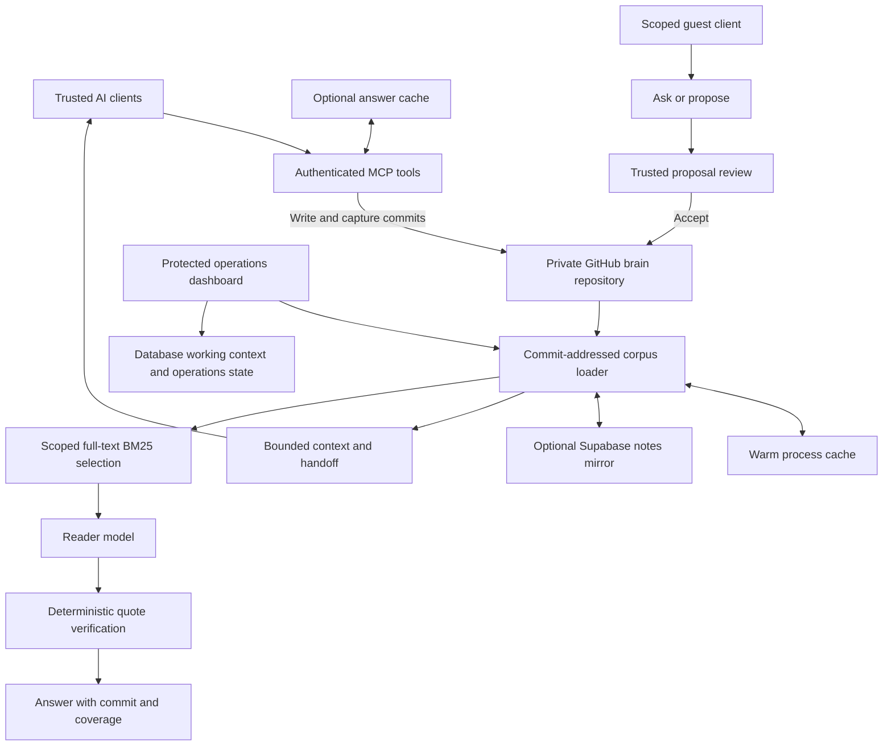
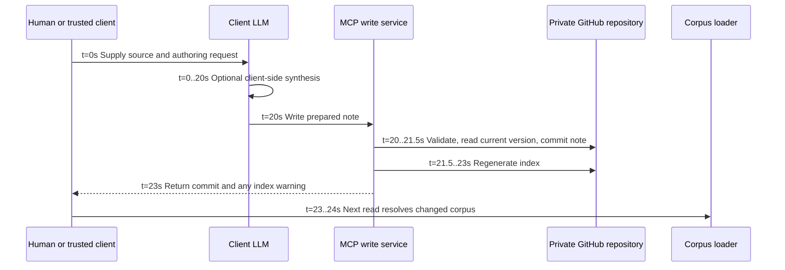
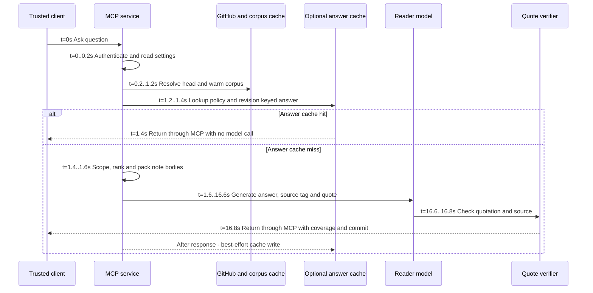

# Cortex: Git-backed agent memory with bounded, verifiable retrieval

Reviewed **2026-09-18**. System dossier 3 of 3. Return to the
[comparative decision](README.md); see also [Karpathy](karpathy.md) and
[Transpara](transpara.md).

## Evidence and scope

Inspected the public `Obelyth/cortex` repository at commit
`ec57124a90ba9c378c5a9b989fe0f5d8f9c98da3`. This is the fetched default-branch
snapshot, not an assertion that every feature ships in every release. The README
explicitly distinguishes main from release-tag documentation. No private brain,
live installation, provider account, or maintainer performance dataset was
accessed. [C1]

**Implemented** refers to the public TypeScript source. **Optional** requires
configuration of additional services. **Analysis** identifies our inference.
Comments about the maintainer's own corpus are not reproduced as general
performance evidence. The public roadmap targets a self-managed single-tenant
installation; named collaborator permissions remain future work. [C2]

## Philosophy and architectural contract

Cortex puts the durable memory behind a tool boundary so different compatible
clients can consult and update it. It distinguishes persisted notes from
temporary/working context and makes retrieval expenditure inspectable. Its
strongest epistemic control is narrower than truth checking: the answer pipeline
tests whether the quoted text occurs in the claimed source at the identified
commit. It does not prove the answer follows from that quotation. [C1], [C6]

The important distinction from Karpathy is ownership of semantic work. Cortex
provides write/capture/edit tools and a reader pipeline. A trusted client or
human can use those tools to maintain a synthesized wiki, but the public tool
contract does not require every new source to trigger multi-page synthesis,
conflict reconciliation, and a semantic lint pass. Its default durable object
is a note, not necessarily a compiled interpretation of immutable evidence.
[C3], [C7]

## Architecture

Durable notes live in a private GitHub repository separate from application
source. The optional database's **notes mirror** is rebuildable from that
repository; working notes, device records, and operations history are not.
Treating the entire database as a disposable cache would lose real state.
The README's hosted setup uses Vercel, while local development uses the same web
application. Self-managed does not imply a fully offline hosted runtime. [C1]

The corpus loader resolves the branch commit, reuses a matching warm cache or
in-flight load, tries the optional reconciled mirror, and can fetch a pinned
GitHub tarball. A head-resolution failure can serve a previously cached corpus
when not forced; results remain identified by that corpus's commit. Thus its
freshness contract admits visible staleness under failure rather than claiming
that every response observes the latest write. [C4]

## Lifecycle and philosophical axes

| Axis | Observed design | Architectural consequence / analysis |
| --- | --- | --- |
| Ingestion | Trusted write/create/replace/append/edit and timestamped capture; guest proposals require acceptance. | Reliable note mutation primitives do not themselves interpret external evidence. [C3], [C7] |
| Storage | Git Markdown notes plus optional database state and KV. | Portable durable notes; complete recovery needs more than a Git clone when optional features are used. [C1] |
| Indexing | Generated descriptions/router for context; full-text BM25 shortlist for Ask; explicit path reads and bounded corpus paging. | Avoids an embedding service; lexical selection can miss paraphrases. [C3], [C5], [C10] |
| LLM role | Reader on Ask; external trusted clients can author through tools. | Separates storage operations from the intelligence of the calling agent. [C3], [C7] |
| Citation evidence | Commit, source path, and normalized quote matching within a block. | Stronger quote provenance than citation-ID membership; still no semantic entailment proof. [C6] |
| Query persistence | Optional answer cache, call records, explicit note tools. | Cached answers save calls but are not new curated concept pages. [C8], [C3] |
| Authority | Trusted read/write access; separate scoped guest ask/propose surface. | Meaningful trust separation, but not a complete named-user enterprise publication model. [C1], [C2] |
| Maintenance | Precise edits, index regeneration, historical exclusions, corpus/mirror repair, operations receipts. | Good memory plumbing; automatic semantic integration remains a client/workflow responsibility. [C4], [C7] |

### Retrieval details that affect evaluation

The default Ask shortlist requests **15 notes**, applies a default **one-log
cap** and **two history-parts per source-page cap**, and packs full note text.
Both narrowed and `full` packs enforce **400,000 UTF-8 body bytes** by skipping
notes that would exceed the budget and continuing to consider later notes.
Neither mode means unbounded whole-corpus inference. These are byte controls,
not tokenizer-exact budgets. Some introductory comments still describe a
first-note exception; the actual `capLogs` admission check has no such exception.
This assessment follows the executable implementation.
[C5], [C11]

Ranking uses actual body text, which can surface facts absent from a summary.
An empty lexical match falls back to large notes subject to caps. Diagnostics
expose the shortlist and reasons for omission. However, the code's “complete
for this question” condition can mean that every note with matching query words
was considered. **Lexical coverage is not semantic recall**: a relevant note
using only synonyms may have zero signal. This is an important limit on absence
claims even when the pipeline behaves exactly as implemented. [C5], [C11]

Quote checking normalizes some Unicode, whitespace, and Markdown formatting,
then confines matching to a block. “Verbatim” in product language therefore
does not mean byte-for-byte equality. Superseded/correction markers and ambiguous
quotes receive additional handling. The source tag is resolved by the server;
the model does not get to invent an authoritative source path. [C6], [C11]

## Ingest swim lanes and timing model

**Illustrative schedule, not measurement.** Assume one 2,000-word source already
available to a trusted client, a 100-note corpus, no Git conflict, and a client
that chooses to synthesize a note. That optional client work is outside the
server's note-write primitive. Bulk import and guest review have different paths.

Example durable-write workflow: **23 s**, including 20 s of optional external
model work; example next-read visibility: **24 s**. Server write work alone is
3 s in this invented schedule. A prepared human note need not call a model at
all. A write can commit successfully while index regeneration fails, in which
case `indexWarning` is returned; these steps are not one atomic transaction.
Append/edit conflict handling re-applies the operation to fresh content and
rechecks exact-edit uniqueness. [C7]

General path: `T_ingest = external_authoring + Git_read_write + index_update`.
Semantic integration across related pages is extra client work, not hidden in
the three-second persistence allowance. Guest proposals add an unbounded human
review wait. A database mirror can reconcile on a subsequent read. [C3], [C4]

## Query swim lanes and timing model

This is the **trusted MCP `brain_ask`** path with optional KV configured, a warm
matching corpus, and an answer-cache miss. It is not a promise about the
dashboard route or every client.

Example miss: **16.8 s**; example hit: **1.4 s**, excluding client rendering.
The 15-second reader allowance matches the other dossiers' answer stage.
Cold tarball/mirror loading is excluded, so these totals must not be presented
as a comparative speed test. Even a hit needs corpus/revision resolution and
cache access. [C3], [C4], [C8]

Actual MCP timing controls are a **60-second route wall**, **55-second work
budget**, **45-second reader maximum**, and **3-second post-reader reserve**.
The reader is not started with less than 5 seconds of usable budget. The mirror
has a maximum 20-second race, reduced to leave a 15-second tarball reserve.
These stages share a remaining deadline; their maximum values cannot simply be
added and assumed to fit. KV answer reads have a 1.5-second timeout and degrade
to a miss. These are implementation limits, not percentile measurements.
[C9], [C4], [C8]

## Efficiency and scaling

Cortex saves model cost in three different ways: tools that return context
without invoking a server-side reader, lexical narrowing before inference, and
optional revision/policy-keyed answer reuse. The caller's own model may still
charge for tool output. Model-free at the server is not necessarily model-free
end to end. [C1], [C3]

The answer cache key includes normalized question, corpus revision, model,
selection setting, trust/scope/citation policy, and pipeline version. A changed
brain head invalidates reuse even if the particular answer's supporting note
was unchanged. Stable prompt prefixes can also support provider prompt caching,
but that depends on provider behavior and identical packed context; it is a
different mechanism from returning a stored answer without inference. [C8], [C11]

A useful cost model is `C = authoring + persistence + q*(lookup + (1-h)*reader)`,
where `h` is answer-cache hit rate for matching revision and policy. It is not
valid to assume a high `h` in a frequently edited brain. Whole-corpus loading
and full-text lexical preparation consume CPU/memory as notes grow, even when
the provider receives only a bounded shortlist. The tar decompression ceiling
is 64 MiB; it is a protective limit, not a supported-scale benchmark. [C4], [C5]

The default reader contract requests a short answer and one source tag/quote.
That is useful for grounded memory lookup but narrower than a fully evidenced
multi-source research report. A trusted agent can assemble a richer report via
multiple reads; that incurs additional work and is not the default Ask contract.
[C11]

## Failure modes and recovery

| Failure | Implemented response | Remaining limitation |
| --- | --- | --- |
| GitHub head lookup fails | A warm cached revision may be served with its commit identity. [C4] | Currentness is not guaranteed; a cold instance may fail. |
| Optional notes mirror fails or stalls | Bounded attempt then GitHub fallback. [C4] | The fallback still needs network access and remaining request time. |
| Quote is fabricated or points outside the pack | Verification/protocol diagnostics expose failure. [C6], [C11] | Correct quotation cannot validate the answer's reasoning. |
| Relevant note uses different vocabulary | Coverage/selection diagnostics make omissions inspectable. [C5] | Diagnostics do not supply semantic recall. |
| Note saved, derived index update fails | Commit succeeds with index warning. [C7] | Client must heed partial completion. |
| Database lost | Notes mirror can be rebuilt. [C1] | Working state and operations history require independent backup. |
| Trusted tool credential used by the wrong client | Separate trusted and guest entry points exist. [C1] | Trusted access remains broad; named collaborator governance is future work. [C2] |

Historical/archive exclusions help keep old notes out of current retrieval,
but a correction that is never authored cannot be discovered through index
repair. The operations sweep checks operational state and alerts; it is not
evidence of a semantic wiki-lint engine. [C12]

## Adversarial assessment

**Strongest case:** among these alternatives, Cortex supplies the most concrete
combination of interoperable agent access, bounded retrieval, commit-addressed
evidence checks, omission diagnostics, and repeat-answer cost controls.

**Strongest objection:** it can be an excellent memory server over poorly
synthesized notes. Quote verification may rigorously demonstrate that the wrong
or obsolete claim was written down. Neither the dashboard nor the retrieval
pipeline makes semantic maintenance automatic.

**Disqualifying mismatch:** do not choose this unextended public design for
mandatory named-user enterprise publication controls or an out-of-the-box
immutable-raw-to-multi-page synthesis compiler. The examined implementation
does not establish either contract.

**Best fit:** a single owner's durable memory used by several trusted AI
clients, where retrieval transparency and operational behavior matter. It is
the [overall decision's narrow winner](README.md#decision), with explicit
qualifications; adding Karpathy-style maintenance would be further work, not
a capability silently included in that verdict.

## Source register

All external implementation links use the inspected commit’s unambiguous
12-character abbreviation, `ec57124a90ba`; its full SHA is recorded above.

- **C1:** [README: setup, tools, optional services, backup boundaries][C1].
- **C2:** [Roadmap and single-tenant scope][C2].
- **C3:** [MCP tools, cache wiring, trusted/guest paths][C3].
- **C4:** [Corpus loading, caches, mirror fallback, archive exclusions][C4].
- **C5:** [BM25 narrowing and pack caps][C5]; [lexical scorer][C13].
- **C6:** [Deterministic citation verifier][C6].
- **C7:** [Context, note mutation, capture and index regeneration][C7].
- **C8:** [Answer-cache key, timeout and storage][C8].
- **C9:** [Shared deadline arithmetic][C9].
- **C10:** [Bounded explicit-path/ranked corpus selection][C10].
- **C11:** [Reader contract, packing, coverage and answer pipeline][C11].
- **C12:** [Operations sweep][C12].

[C1]: https://github.com/Obelyth/cortex/blob/ec57124a90ba/README.md
[C2]: https://github.com/Obelyth/cortex/blob/ec57124a90ba/ROADMAP.md
[C3]: https://github.com/Obelyth/cortex/blob/ec57124a90ba/lib/tools.ts
[C4]: https://github.com/Obelyth/cortex/blob/ec57124a90ba/lib/corpus.ts
[C5]: https://github.com/Obelyth/cortex/blob/ec57124a90ba/lib/narrow.ts
[C6]: https://github.com/Obelyth/cortex/blob/ec57124a90ba/lib/verify.ts
[C7]: https://github.com/Obelyth/cortex/blob/ec57124a90ba/lib/brain.ts
[C8]: https://github.com/Obelyth/cortex/blob/ec57124a90ba/lib/anscache.ts
[C9]: https://github.com/Obelyth/cortex/blob/ec57124a90ba/lib/deadline.ts
[C10]: https://github.com/Obelyth/cortex/blob/ec57124a90ba/lib/select.ts
[C11]: https://github.com/Obelyth/cortex/blob/ec57124a90ba/lib/ask.ts
[C12]: https://github.com/Obelyth/cortex/blob/ec57124a90ba/lib/sweep.ts
[C13]: https://github.com/Obelyth/cortex/blob/ec57124a90ba/lib/lexical.ts

## Document revision history

| Version | Date | Change |
| --- | --- | --- |
| 0.1.0 | 2026-09-18 | Establish Transpara document control and a SemVer baseline for previously unversioned content. |
