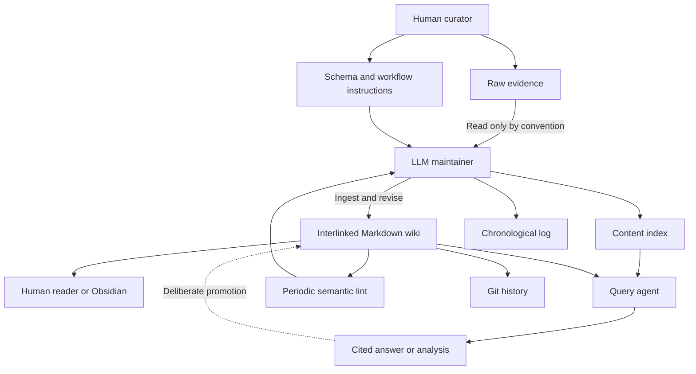
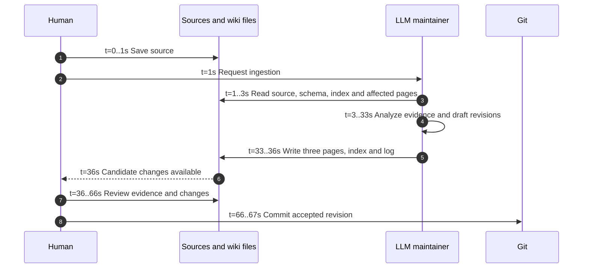
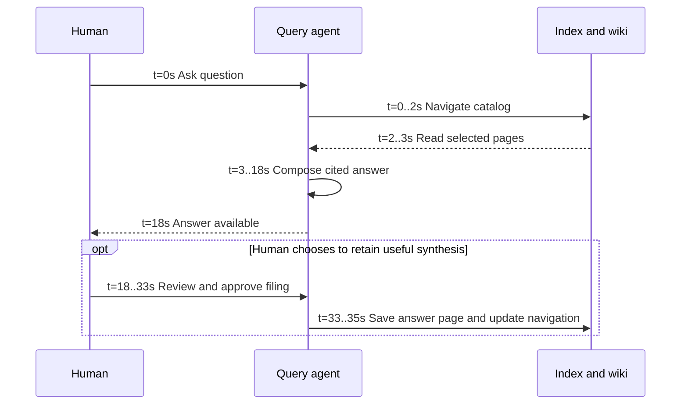

# Karpathy LLM Wiki: knowledge compiled into a maintained artifact

Reviewed **2026-09-18**. System dossier 1 of 3. Return to the
[comparative decision](README.md); see also [Transpara](transpara.md) and
[Cortex](cortex.md).

## Evidence and scope

The primary source is Karpathy's own **LLM Wiki idea file**, created April 4,
2026, inspected at gist revision
`ac46de1ad27f92b28ac95459c782c07f6b8c964a`. This is a pattern specification,
not a released application or benchmark. “Original” here means that first-party
idea file, not an implementation built by somebody else. Its discussion comments
are not part of the architecture. [K1]

**Specified** below means the author describes a behavior. **Analysis** means
our architectural inference. No running Karpathy installation was inspected.
The original defines a small operational vocabulary: protected source material,
derived Markdown, an agent instruction document, and ingest/query/lint workflows.
It makes persistent synthesis central and permits search tooling as the corpus
grows. It gives neither an enforced transaction protocol nor measured latency.
[K1]

## Philosophy and architectural contract

The defining decision is where reasoning leaves its result. In this design, a
useful interpretation becomes part of the corpus and can support the next
question. A retrieval-only workflow can repeatedly pay to discover the same
connection; a compiled wiki tries to pay that cost once, then pay the cost of
keeping the connection correct. This is an architectural trade, not a proof
that all retrieval systems lack persistence or that compilation is always cheaper.

Three principles follow from that decision:

1. The source and the interpretation need distinct identities. Otherwise a
   model correction can erase the evidence needed to challenge the correction.
2. Updating a summary is insufficient when the claim also appears in several
   entity pages. The unit of semantic maintenance is the affected set of pages.
3. A successful conversation has potential archival value. Filing a useful
   answer turns exploration into future context rather than a dead chat transcript.

The resulting wiki is a **materialized interpretation of evidence**. It is
readable without inference, but it is never automatically authoritative. A model
can faithfully maintain the links between incorrect claims.

## Architecture

The instruction document is a control plane: it establishes page conventions,
workflow obligations, and how an agent should act. It is not a parser, permission
system, or scheduler. The model is the semantic compiler; files are its durable
output. The index is a routing aid, while the log records activity. Git supplies
versioning when changes are committed. [K1]

The arrows describe the intended workflow. They do not establish that an agent
cannot modify raw files, that all changed pages are committed atomically, or that
semantic lint runs without somebody requesting it.

## Lifecycle and philosophical axes

| Axis | Specified pattern | Architectural consequence / analysis |
| --- | --- | --- |
| Ingestion | Read a source and revise its affected wiki pages. | More initial reasoning buys reusable interpretation; simple document registration does not satisfy this contract. |
| Storage | Separate source material and derived, interlinked Markdown. | Strong portability; source immutability still needs enforcement in an implementation. |
| Indexing | An explicit catalog routes reading; richer search is optional. | Low infrastructure cost initially; a growing catalog consumes context and can omit important connections. |
| LLM role | Maintainer, answerer, and semantic reviewer. | Maximum semantic responsibility also creates maximum opportunity for error propagation. |
| Query | Read relevant compiled pages, answer with citations, optionally persist the result. | Retrieval operates over an already interpreted corpus; complex questions still require reasoning. |
| Maintenance | Revisit contradictions, stale claims, missing links, and gaps. | Semantic freshness is a first-class goal, but completion is not mechanically guaranteed. |
| Authority | Human curates and directs; agent maintains. | Suitable for a personal research loop; shared editing and publication policy must be supplied. |
| Observability | Index, chronological activity log, and committed file history. | Human-readable auditability; no specified metrics, failure receipts, or latency instrumentation. |

The specified behaviors in this table come from the [original idea file][K1].
The implications are our assessment, not extra features attributed to it.

## Ingest swim lanes and timing model

**Illustrative schedule, not measurement.** Assume one already-extracted
2,000-word source, a 100-page existing wiki, three pages affected, one writer,
and no retries. Local file work, model work, and human review are assigned
explicit planning durations. Source acquisition/OCR and queue delay are excluded.
These choices are not promises made by Karpathy.

| Interval | Lane | Assumed time | Completion means |
| --- | --- | ---: | --- |
| 0–3 s | Human + files | 3 s | Evidence and relevant context loaded. |
| 3–33 s | LLM | 30 s | A candidate interpretation exists. |
| 33–36 s | Files | 3 s | Candidate pages and navigation updated. |
| 36–66 s | Human | 30 s | Reviewer accepts this example's changes. |
| 66–67 s | Git | 1 s | A recoverable version is committed. |

Example total: **67 s**, including human review. General critical path:
`T_ingest = capture + context_read + synthesis + writes + human_review + commit`.
The review/commit sequence is an evaluation scenario added here, not a mandatory
transaction design in the idea file. Unattended ingestion removes a human wait;
it does not remove the need to establish correctness.

## Query swim lanes and timing model

Assume a question answerable from three compiled pages. The 15-second answer
generation assumption is shared with the other dossiers solely for illustration.
Each diagram resets its clock to zero.

Example answer latency: **18 s**; durable promotion: **35 s** including the
optional review. A real agent may interleave several searches and model calls.
This diagram is a logical execution, not a claim of one inference call per query.
There is no specified timeout or throughput ceiling in the original pattern.

## Efficiency and scaling

Let `I` be synthesis cost per source, `U` the number of sources ingested, `M`
maintenance cost, `q` the number of questions, and `R` query reasoning cost over
the wiki. Then a planning model is `C = U*I + M + q*R`. This excludes storage and
human review unless explicitly priced into the variables.

Against a baseline that repeatedly reasons over raw evidence at cost `D` per
question, compilation pays back only if `q*(D-R) > U*I + M` and `D > R`.
If the corpus changes faster than questions reuse it, compilation can be an
expensive speculation. If questions repeatedly need the same cross-document
connections, it can be valuable amortization. No supplied benchmark quantifies
those variables.

Scale has two separate limits. Catalog navigation grows with the number and
description length of pages; maintenance grows with the number of dependencies
affected by each correction. Faster retrieval addresses the first without
solving the second. An embedding index is compatible with this pattern but
cannot decide which previously published interpretations are now false.

## Failure modes and recovery

| Failure | Consequence | What an implementation must add or do |
| --- | --- | --- |
| Misread evidence propagated into multiple pages | A coherent wiki repeats the same error. | Review the affected set against original evidence; track claim dependencies. |
| Agent stops during a multi-page edit | Index, log, and articles may disagree. | Stage changes, validate links, review the diff, and commit together. |
| Model ignores raw-file convention | Original evidence can be altered. | Enforce separate write permissions or immutable snapshots. |
| A citation is real but does not support the claim | Plausible prose launders an inference. | Check entailment; citation formatting alone is insufficient. |
| Periodic lint is never requested | Maintenance debt accumulates invisibly. | Establish an owner, cadence, and explicit unresolved queue. |
| Concurrent agents revise the same concept | Lost or inconsistent interpretation. | Serialize semantic changes or require merge review. |

Git recovery applies to committed bytes. It does not rescue material that was
never saved or prove that an earlier version was correct. Offline Markdown
reading is straightforward; offline model operation depends on the chosen host
and model, which the pattern does not prescribe.

## Adversarial assessment

**Strongest case:** this is the clearest definition of a wiki that learns. The
durable artifact improves through both reading and questioning, and semantic
maintenance is part of the core workflow rather than an optional UI feature.

**Strongest objection:** the agent instruction document is doing the work of
an unbuilt runtime. Instructions to keep everything consistent do not supply
transactions, evidence validation, scheduling, access separation, or reliability.
The pattern can be excellent while a particular installation is unreliable.

**Disqualifying mismatch:** use a different or extended design if deployment
requires already-enforced audience boundaries, deterministic verification of
quoted evidence, or a supported multi-user service. Those do not follow from a
directory of Markdown and a competent agent.

**Best fit:** personally supervised research with repeated questions and a
manageable stream of new evidence. Its superiority on synthesis is a judgment
about its contract, not evidence that an unspecified installation outperforms
the two implemented systems. The [comparison](README.md#weighted-kt-analysis)
charges that distinction explicitly in other criteria.

## Source register

- **K1 — First-party specification:** [LLM Wiki, pinned gist revision][K1].
  Sections: Core idea, Architecture, Operations, Indexing and logging, Optional
  CLI tools. This dossier's timing schedules, formulas, implementation risks,
  and decision judgments are original analysis rather than reported results.

[K1]: https://gist.github.com/karpathy/442a6bf555914893e9891c11519de94f/ac46de1ad27f92b28ac95459c782c07f6b8c964a

## Document revision history

| Version | Date | Change |
| --- | --- | --- |
| 0.1.0 | 2026-09-18 | Establish Transpara document control and a SemVer baseline for previously unversioned content. |
