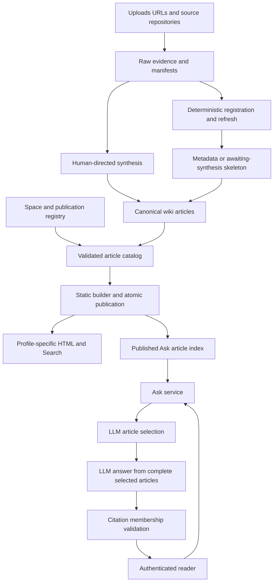
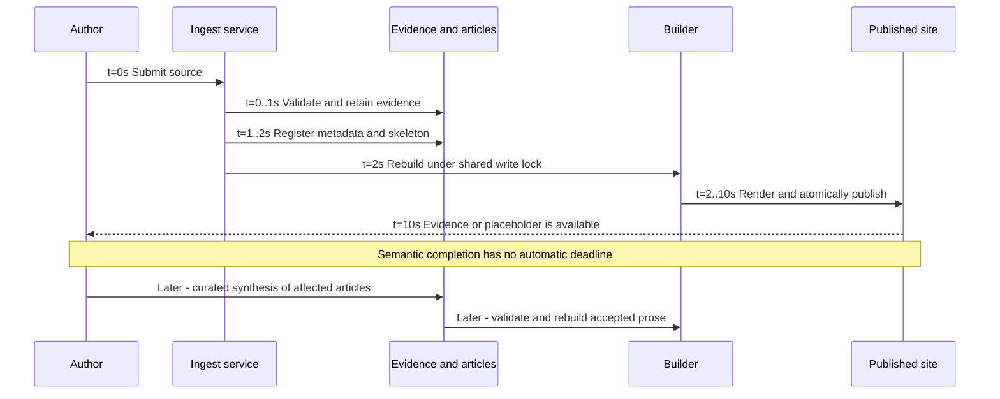
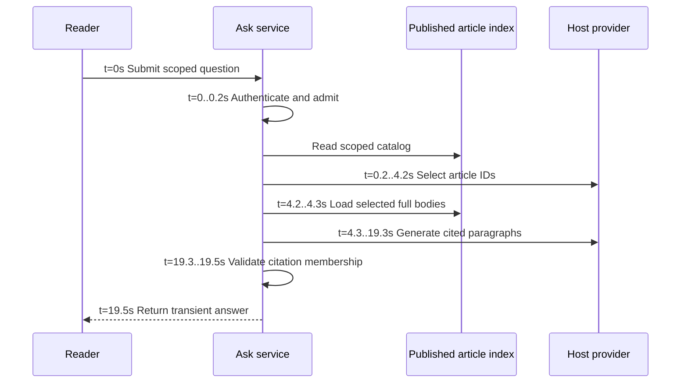

# Transpara Knowledge Hub: curated knowledge with governed publication

Reviewed **2026-09-18**. System dossier 2 of 3. Return to the
[comparative decision](README.md); see also [Karpathy](karpathy.md) and
[Cortex](cortex.md).

## Evidence and scope

Inspected local repository revision
`d059acc3575850e51b58b4b2f95a3a5fc428fa40`, reporting version **0.8.3**.
This is a source-code assessment, not a live deployment audit. This dossier records the original comparison baseline. Subsequent branch work
adds the v0.9.0 discovery/review workflow; its [CFAR swim lanes and timing model](../../compile/DISCOVERY.md#cfar-ingestion-and-research-swim-lanes)
cover human submissions, research, monitoring, both reviewers, challenge, repair
and human publication. Those additions are not retroactive evidence for the
baseline scores below. The existing
[Karpathy-pattern audit](../karpathy-pattern-audit.md) supplies a useful earlier
assessment, and the code paths below were checked directly.

**Implemented** means observable in the inspected source. **Documented** means
an operational contract that still requires installation/configuration.
**Analysis** and **proposed** do not imply shipped capabilities. The source
register identifies the implementation files that own each important claim.

## Philosophy and architectural contract

The Hub treats knowledge as a shared publication asset. A single canonical
article can appear in several spaces without duplicating its prose. Placement
answers where a reader finds it; classification controls which publication
profile can include it; stewardship names responsibility. The Hub explicitly
remains advisory to code, accepted decisions, configuration, and operational
systems. [Design][T1]

This makes publication policy a stronger organizing force than autonomous
learning. The crucial distinction is between **evidence freshness**, **build
freshness**, and **semantic freshness**. Updating a source mirror and rendering
the site can establish the first two while leaving the article's interpretation
untouched. The code and operational guide deliberately reserve substantive
synthesis for a separate workflow. [Refresh][T3], [Rebuilding][T2]

That is not automatically a defect: explicit curation can be the right cost and
authority decision for company knowledge. It does mean that the system cannot
claim automatic compounding merely because sources have been ingested.

## Architecture

The four current spaces are Civilization, Transpara Platform, Competition, and
DevOps. The article catalog and registry mediate published content. The builder
stages a complete artifact and exchanges output directories atomically on
supported filesystems, preserving the prior site on failed builds. Ask indexes
the published canonical article corpus, excluding raw-source and repository
pages. [T1], [Builder][T7], [Ask][T5]

The documented Ask deployment uses a restricted transport to a host-owned
provider dispatcher. Provider credentials are outside the wiki container;
fixed provider execution disables tools, shell, web, plugins, and MCP for these
calls. This is a documented/implemented boundary, not evidence that the current
host's credentials or configuration were requalified for this comparison.
[Ask operations][T6]

## Lifecycle and philosophical axes

| Axis | Observed design | Architectural consequence / analysis |
| --- | --- | --- |
| Ingestion | Capture/register evidence; normal article creation can produce an awaiting-synthesis skeleton. DevOps can accept supplied prose. | Fast evidence availability is independent of completion of knowledge work. [T4] |
| Storage | Canonical `wiki/` articles, `raw/` evidence, manifests/ledgers, generated output. | Portable content with more schema and deployment machinery than a personal vault. [T1] |
| Indexing | Generated navigation and lexical Search; Ask uses a title/description catalog before loading complete selected bodies. | Human Search and LLM selection have different cost and recall characteristics. [T5], [T7] |
| LLM role | Two-stage Ask; human-directed Tier 2 rewriting; optional single-article synthesis hook. | Model use is explicit; no inspected integrated multi-article semantic compilation loop. [T2], [T5], [T8] |
| Authority | Space, steward, classification, publication profile, authenticated reader and separate authoring boundaries. | Best fit among these designs for a company-controlled reading surface. [T1], [T6] |
| Maintenance | Structural validation, source hashing, deterministic rebuild, explicit curated synthesis. | Structural health is more observable than semantic completeness. [T2], [T3] |
| Query persistence | Ask answers/prompts remain transient. | Useful analysis does not automatically improve future article context. [T6] |
| Distribution | Profile-specific static artifacts plus optional live services. | Reading/Search can continue without model availability. [T7], [T6] |

### Three distinctions that must survive any comparison

1. `index.md` is a reader portal. Generated catalogs supply other navigation
   roles; failing to copy Karpathy's exact filename semantics is not the gap.
2. `run_engine` is real code for an authority-gated single-article body
   replacement. An empty command disables it; its existence is not proof that
   it is enabled, routinely used, or coordinating all affected articles. [T8]
3. A successful refresh clears `stale_articles` and reports changed articles.
   The source mirror uses `rsync --delete`; deleted paths are not included in
   the current-file change set. Neither the freshness indicator nor the mirror
   establishes universal immutable evidence retention. [T3]

## Ingest swim lanes and timing model

This is the **v0.8.3 baseline**. For ingestion/research vetting through CFAR,
use the [v0.9.0 workflow and timing](../../compile/DISCOVERY.md#cfar-ingestion-and-research-swim-lanes).

**Illustrative schedule, not measurement.** Assume one already-extracted
2,000-word source, a 100-page corpus, no lock contention, and an eight-second
build. This models a skeleton-producing browser path; supplied-prose and
replacement operations differ. No source fetch/OCR is included.

| Stage | Example time | What it establishes |
| --- | ---: | --- |
| Source capture | 1 s | Retained submitted evidence. |
| Metadata/skeleton | 1 s | Registered material with honest incomplete prose. |
| Deterministic publication | 8 s | New artifact available. |
| Human-directed synthesis | Unbounded wait + work | A semantic change only when somebody performs it. |

Example registration latency: **10 s**. Semantic completion is
`10 s + wait_for_curator + synthesis + review + subsequent_build`, not 10 seconds.
The source-registration endpoint's success must not be counted as a completed
Karpathy-style ingest. The timer and authoring service share a write lock;
contention and host repository scans add waiting not shown here. [T2]

## Query swim lanes and timing model

**Example, not benchmark:** 0.2 s admission, 4 s model selection, 0.1 s local
loading, 15 s answer generation, 0.2 s validation = **19.5 s**. Provider
readiness/transport costs are folded into these allowances; cold starts and
contention are excluded. The two model stages are serial. The no-evidence path
can finish without the answer stage. [T5]

Actual code limits are **12 selected articles**, **200,000 characters** of
selected article text, and a **240-second question deadline**. Excess selected
context fails rather than silently truncating articles. Admission reserves one
question per reader and per provider across both stages on the shared-volume
deployment; a busy provider can reject a different reader's simultaneous
question. These are bounds and concurrency rules, not observed latency.
[Ask constants][T9], [T5], [T6]

## Efficiency and scaling

There are three cost centers: deterministic publishing, curated synthesis,
and interactive Ask. Conflating them makes the Hub look either deceptively cheap
or needlessly slow. A planning model is
`C = builds*B + curated_updates*S + questions*(selection + answer)`.
Static reads and lexical Search add hosting/client cost without model calls.

The static artifact gives the Hub a strong read-distribution design. Its Ask
path does not inherit that scalability automatically: the per-provider lock is
a deliberate shared bottleneck, the selector sees the scoped catalog, and the
answerer has finite body context. Wider corpus coverage can increase selector
input even when the output remains capped. [T5], [T6]

The design avoids chunk reconstruction by supplying complete articles, which
preserves local prose context. It risks missing a page if its title/description
does not reveal the fact the question needs. The inspected Ask path has no
application-level answer cache and no automatic query-to-article promotion.
Subscription access is not zero marginal resource use: latency, quotas, and
concurrency remain costs even without a per-call API invoice.

## Failure modes and recovery

| Failure | Observed protection | Remaining weakness |
| --- | --- | --- |
| Bad build or incompatible output exchange | Prior published site is preserved. [T7] | Readers can continue seeing old content; operators must inspect status. |
| Provider unavailable or timed out | Ask returns failure; Search is independent. [T6] | No new answer, and no automatic provider fallback. |
| Citation outside supplied evidence | Membership validation rejects it. [T5] | A valid article ID can still support a false inference or invented quotation. |
| Source updated but prose untouched | Changed-source metadata and explicit manual synthesis path. [T2], [T3] | Rebuild freshness can be mistaken for semantic currency. |
| Upstream source removed or overwritten | Committed Git history may retain previous material. | Mirror itself is mutable; uncommitted removed material is not recovered by Git. [T3] |
| Accidental wrong-audience publication | Classification and profile validation. [T1] | Serving the wrong artifact/route remains an operational concern; no live boundary test was run here. |

A local Markdown checkout or complete locally served artifact is usable without
a model. The hosted SSO route needs its network/services, and the inspected
browser assets do not establish a packaged offline application. Rebuildability
also depends on available source material and host-specific repository inputs;
copying `dist/` and reconstructing a full authoring environment are different
recovery objectives. [T2], [T6], [existing audit](../karpathy-pattern-audit.md)

## Adversarial assessment

**Strongest case:** the Hub takes audience, provenance, canonical identity, and
publication continuity seriously. It is a better company publication design
than delegating all responsibility to a personal agent instruction file.

**Strongest objection:** the machinery can make an incomplete knowledge process
look finished. Successful registration, a healthy build, and a cited answer do
not demonstrate that new evidence revised every affected interpretation.

**Disqualifying mismatch:** if the requirement is an already-integrated,
continuously compounding ingest/query/lint loop, this inspected implementation
does not supply it. An optional body-replacement hook does not close that gap.

**Best fit:** curated internal knowledge distributed to readers with explicit
classification and publication boundaries. To compete for best synthesis wiki,
the next work is a reviewed affected-article update workflow, immutable source
versions, a semantic-review queue, and deliberate answer promotion. Those are
proposals, not features credited in the scoring.

## Source register

The relative links resolve to this repository. For the inspected snapshot,
use the [baseline tree][T0] at the exact revision above, not a later branch tip.

- **T0:** [Inspected repository tree][T0].
- **T1:** [Design and article/publication model][T1].
- **T2:** [Rebuilding: deterministic Tier 1 and manual Tier 2][T2].
- **T3:** [Refresh implementation][T3], especially `mirror_sources` and `main`.
- **T4:** [Ingest service][T4], especially `create_article_from_source`.
- **T5:** [Ask implementation][T5], especially `admission`, `answer`, `build_index`.
- **T6:** [Ask deployment and behavioral contract][T6].
- **T7:** [Static builder][T7] and [catalog](../../compile/article_catalog.py).
- **T8:** [Ingest operations][T8], especially `run_engine`.
- **T9:** [Ask limits and schemas][T9].

[T0]: https://github.com/transpara-ai/wiki/tree/d059acc3575850e51b58b4b2f95a3a5fc428fa40
[T1]: ../../DESIGN.md
[T2]: ../../compile/REBUILD.md
[T3]: ../../compile/refresh.py
[T4]: ../../compile/ingest_server.py
[T5]: ../../compile/ask.py
[T6]: ../../compile/ASK.md
[T7]: ../../compile/build_site.py
[T8]: ../../compile/ingest_ops.py
[T9]: ../../compile/ask_common.py

## Document revision history

| Version | Date | Change |
| --- | --- | --- |
| 0.1.1 | 2026-09-18 | Distinguish historical registration timing from the linked v0.9.0 CFAR ingestion/research workflow. |
| 0.1.0 | 2026-09-18 | Establish Transpara document control and a SemVer baseline for previously unversioned content. |
